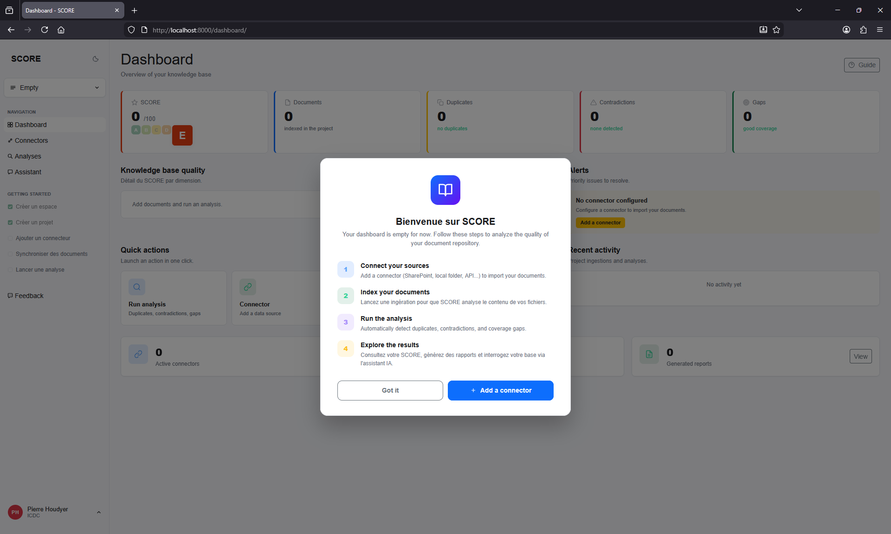
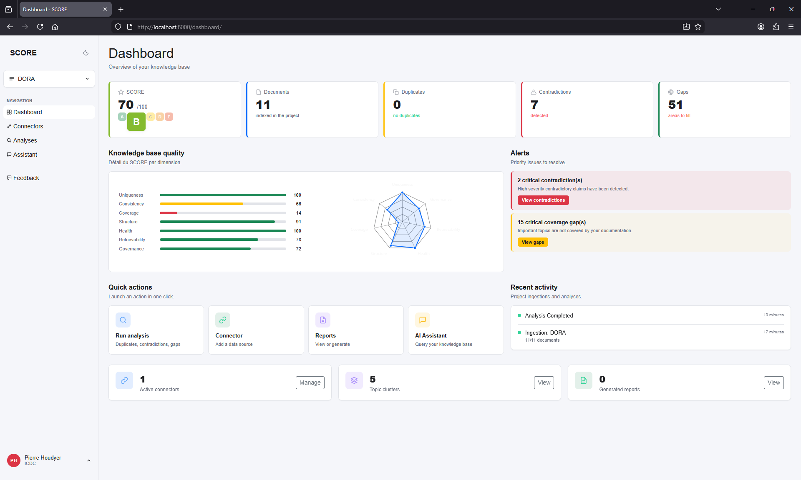
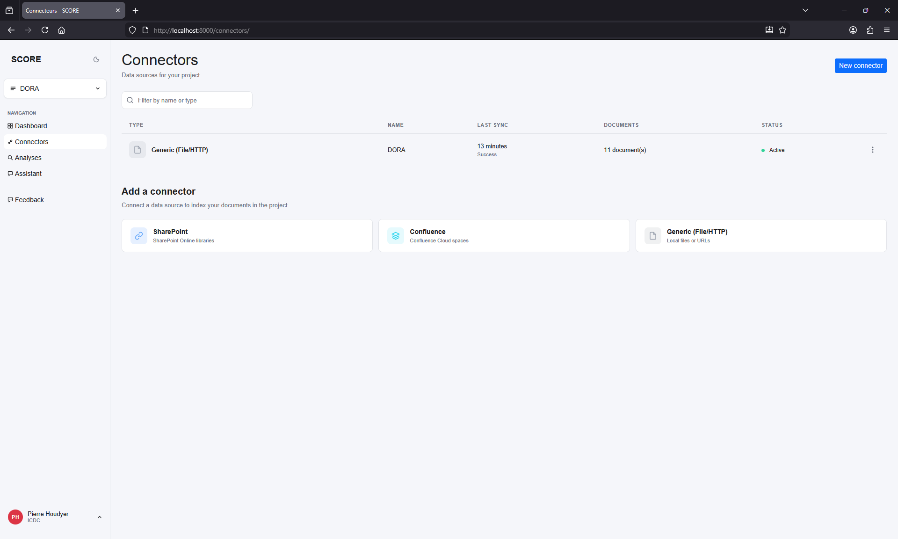
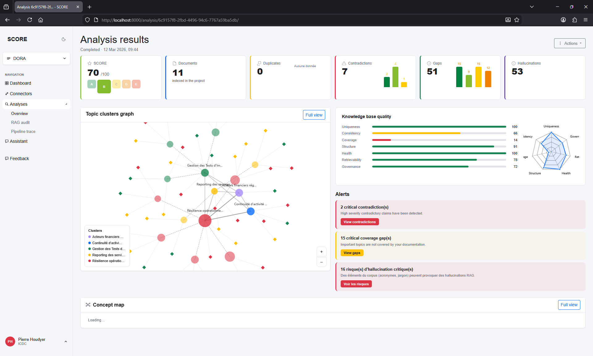
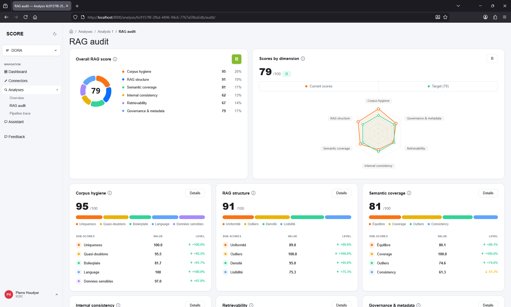
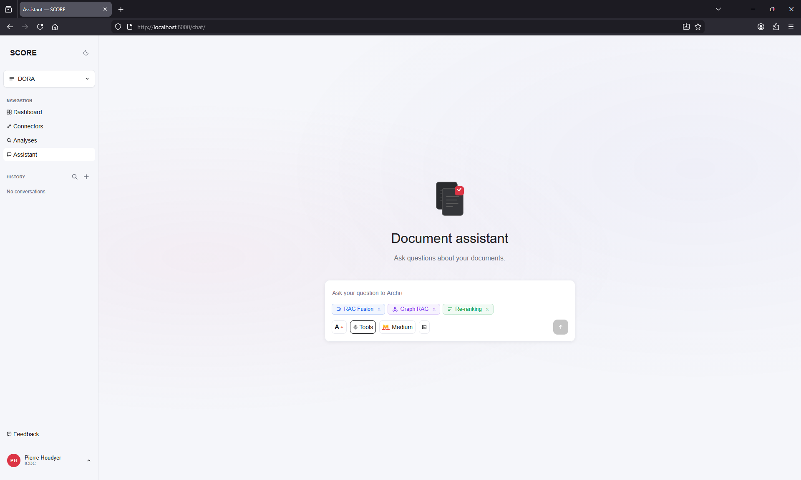

# SCORE - _SCORE Curates Organizational Repository for Embeddings_

Enterprise document repository analysis tool. Ingests documents from multiple sources, detects duplicates, extracts claims, finds contradictions, clusters topics, identifies documentation gaps, flags hallucination risks, runs RAG quality audits, and produces a Nutri-Score-style quality grade (A-E).

Built with Django, SQLite + sqlite-vec, Celery, OpenAI/Azure OpenAI, and spaCy.

<p align="center">
  
  
</p>
<p align="center">
  
  
</p>
<p align="center">
  
  
</p>

---

## Table of Contents

- [Architecture](#architecture)
- [Prerequisites](#prerequisites)
- [Installation](#installation)
- [Docker Deployment](#docker-deployment)
- [Configuration](#configuration)
- [Running the Application](#running-the-application)
- [Tests](#tests)
- [Dependencies](#dependencies)
- [Documentation](#documentation)
- [Contributing](#contributing)
- [License](#license)

---

## Architecture

```
┌─────────────┐     ┌──────────────┐     ┌──────────────────┐
│  Dashboard   │────▶│  Django Web  │────▶│  SQLite (ORM)    │
│  (Bootstrap  │     │  Server      │     │  db.sqlite3      │
│   + D3.js)   │     └──────┬───────┘     └──────────────────┘
└─────────────┘            │
                           │ enqueue
                           ▼
                    ┌──────────────┐     ┌──────────────────┐
                    │  Celery      │────▶│  sqlite-vec      │
                    │  Worker      │     │  vec.sqlite3     │
                    └──────┬───────┘     └──────────────────┘
                           │
                    ┌──────┴───────┐
                    │  OpenAI /    │
                    │  Azure API   │
                    └──────────────┘
```

- **Web server**: Django 5.1, serves the dashboard, chat interface, and triggers async jobs.
- **Task queue**: Celery workers run ingestion, analysis, and audit pipelines.
- **Primary database**: SQLite via Django ORM (`data/db.sqlite3`) for all relational data.
- **Vector database**: Separate SQLite file (`data/vec.sqlite3`) with the sqlite-vec extension for KNN embedding search.
- **LLM**: Unified client supporting OpenAI, Azure OpenAI, and Azure Mistral for embeddings, chat completions, and JSON-mode structured output. Supports fallback models on rate-limit errors.
- **Semantic graph**: spaCy-based concept extraction with NetworkX graph and FAISS index for knowledge-map visualizations.

---

## Prerequisites

- **Python 3.12+**
- **Redis** (for production Celery broker) or use the SQLAlchemy database broker for local development
- An **OpenAI API key**, **Azure OpenAI** deployment, or **Azure Mistral** deployment
- **spaCy model** (optional, for semantic graph): `python -m spacy download fr_core_news_sm`

---

## Installation

### Quick Start

```bash
bash scripts/run_dev.sh
```

This script will:
1. Create a `.venv` virtual environment
2. Install all dependencies from `requirements.txt`
3. Copy `.env.example` to `.env` (with database broker for dev)
4. Run Django migrations
5. Load sample data (users, tenants, documents)
6. Collect static files

### Manual Setup

```bash
# Create and activate virtual environment
python3.12 -m venv .venv
source .venv/bin/activate

# Install dependencies
pip install -r requirements.txt

# Copy and edit environment config
cp .env.example .env
# Edit .env with your API keys and settings

# Run migrations
python manage.py migrate --run-syncdb

# Load sample data (optional)
python scripts/load_sample_data.py

# Collect static files
python manage.py collectstatic --noinput
```

### Default Credentials (from sample data)

> **WARNING:** These are development-only credentials. Change them immediately in any non-local environment. Never use default passwords in production.

| User  | Password | Role              |
|-------|----------|-------------------|
| admin | admin    | Superuser (admin) |
| demo  | demo     | Editor            |

---

## Docker Deployment

A multi-stage Dockerfile is provided for production deployment.

```bash
# Build the image
docker build -t score .

# Run the container
docker run -p 8000:8000 \
  -e SECRET_KEY=your-production-secret-key \
  -e DEBUG=False \
  -e LLM_PROVIDER=openai \
  -e OPENAI_API_KEY=sk-... \
  score
```

The Docker image:
- Uses a multi-stage build (builder + runtime) for smaller image size
- Runs with **gunicorn** (4 workers, 4 threads)
- Includes a `/healthz/` health check endpoint (30s interval)
- Exposes port 8000

---

## Configuration

SCORE reads configuration from two sources, with environment variables taking precedence.

### .env (environment variables)

```bash
# Django
# IMPORTANT: Generate a real secret key for production:
#   python -c "from django.core.management.utils import get_random_secret_key; print(get_random_secret_key())"
SECRET_KEY=change-me-in-production
DEBUG=True
ALLOWED_HOSTS=localhost,127.0.0.1

# Celery broker
CELERY_BROKER_BACKEND=database    # "database" for dev, "redis" for production
CELERY_BROKER_URL=redis://localhost:6379/0

# LLM Provider: "openai", "azure", or "azure_mistral"
LLM_PROVIDER=azure_mistral

# OpenAI
OPENAI_API_KEY=sk-...
OPENAI_CHAT_MODEL=gpt-4o
OPENAI_EMBEDDING_MODEL=text-embedding-3-small
OPENAI_EMBEDDING_DIMENSIONS=1536

# Azure OpenAI (if LLM_PROVIDER=azure)
AZURE_OPENAI_API_KEY=...
AZURE_OPENAI_ENDPOINT=https://your-resource.openai.azure.com/
AZURE_OPENAI_API_VERSION=2024-06-01
AZURE_OPENAI_CHAT_DEPLOYMENT=gpt-4o
AZURE_OPENAI_EMBEDDING_DEPLOYMENT=text-embedding-3-small
# Optional: separate Azure endpoint for embeddings (if different resource)
AZURE_OPENAI_EMBEDDING_ENDPOINT=
AZURE_OPENAI_EMBEDDING_API_KEY=

# Azure Mistral (if LLM_PROVIDER=azure_mistral)
AZURE_MISTRAL_ENDPOINT=https://your-resource.services.ai.azure.com
AZURE_MISTRAL_API_KEY=...
AZURE_MISTRAL_API_VERSION=2024-05-01-preview
AZURE_MISTRAL_DEPLOYMENT_NAME=...

# Rate limits
LLM_REQUESTS_PER_MINUTE=60
EMBEDDING_BATCH_SIZE=100

# Field encryption (connector secrets)
# Generate with: python -c "import secrets; print(secrets.token_urlsafe(32))"
FIELD_ENCRYPTION_KEY=
```

> **Security**: In production (`DEBUG=False`), Django will refuse to start if `SECRET_KEY` is set to a placeholder value. A dedicated `FIELD_ENCRYPTION_KEY` is recommended for encrypting connector secrets (falls back to `SECRET_KEY` if not set).

For analysis tuning via `config.yaml`, see [docs/configuration.md](docs/configuration.md).

---

## Running the Application

### 1. Start the Django Development Server

```bash
source .venv/bin/activate
python manage.py runserver
```

Open http://localhost:8000 (redirects to `/dashboard/`).

### 2. Start the Celery Worker

In a separate terminal:

```bash
source .venv/bin/activate
celery -A score worker -l info
```

**For dev mode without Redis** (using SQLAlchemy database broker):

```bash
# Make sure .env has: CELERY_BROKER_BACKEND=database
celery -A score worker -l info -P solo
```

The `-P solo` flag runs a single-threaded worker, required for the database broker.

---

## Tests

```bash
source .venv/bin/activate
pytest tests/
```

Test configuration is in `pyproject.toml`:

```toml
[tool.pytest.ini_options]
DJANGO_SETTINGS_MODULE = "score.settings"
```

The test suite covers all major modules: analysis views, audit views, chat, chunking, claims extraction, clustering, connectors, contradictions, dashboard, duplicates, gaps, hashing, LLM client, middleware, models, pipeline integration, reports, scoring, semantic graph (NSG), tenant isolation, tracing, and vector store.

---

## Dependencies

**Core:** Django 5.1, Celery 5.4, sqlite-vec 0.1.6, OpenAI SDK, tiktoken, django-allauth, cryptography (Fernet encryption), whitenoise, gunicorn

**ML/Analysis:** scikit-learn, HDBSCAN, datasketch (MinHash), numpy, NLTK, langid, rank-bm25

**Semantic Graph:** spaCy, NetworkX, FAISS (faiss-cpu)

**Document Parsing:** BeautifulSoup4, pypdf, python-docx, python-pptx, markdown

**PDF Export:** xhtml2pdf

**HTTP:** httpx

**Optional Connectors:** msal + office365-rest-python-client (SharePoint), atlassian-python-api (Confluence)

See `requirements.txt` for the full list with version constraints.

---

## Documentation

Detailed documentation lives in the `docs/` folder:

| Document | Description |
|----------|-------------|
| [SCORE_FORMULA.md](docs/SCORE_FORMULA.md) | Scoring formula, 7 dimensions, all edge cases |
| [INGESTION_AND_ANALYSIS.md](docs/INGESTION_AND_ANALYSIS.md) | Ingestion pipeline + analysis methods |
| [stack-and-algorithms.md](docs/stack-and-algorithms.md) | Technical stack and algorithms (French) |
| [deployment.md](docs/deployment.md) | Production deployment guide (Docker, PostgreSQL, nginx) |
| [project-structure.md](docs/project-structure.md) | Full project tree with file descriptions |
| [configuration.md](docs/configuration.md) | config.yaml reference (analysis tuning) |
| [technical-reference.md](docs/technical-reference.md) | Celery tasks, Django apps, DB schema, URL routes, auth, scoring |

---

## Contributing

See [CONTRIBUTING.md](CONTRIBUTING.md) for development guidelines.

---

## License

This project is licensed under the Apache License 2.0 — see [LICENSE](LICENSE) for details.
